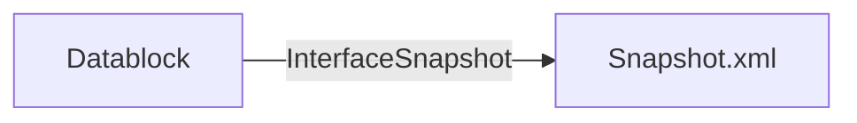

# SnapshotManager

Doing datablock Snapshots in TIA Portal is great, but you are limited to only one Snapshot a time. Normally this is sufficient, because with a change of the datablock structure, it will be impossible to reassign all the snapshot values again.

But there are use cases, where having multiple datablock snapshots is benefitial. For example to check historically how the values have been changed over time.

With this TIA Portal V18 Add-In you will be able to save and restore several snapshots for each datablock.

## Table of Contents

- [Architecture](#architecture)
- [Installation](#installation)
- [Usage](#usage)

## Architecture

By using the Visual Stuido Code Extension [TIA Portal Add-In Development Tools](https://support.industry.siemens.com/cs/de/de/view/109817270) the boilerplate code for integrating the add-in in TIA Portal was created automatically.

The TIA Openness API gives access to the snapshot interface for each datablock. But it is only designed to export the snapshot as a SimaticML file, because a reimport of to a changed datablock interface is impossible. That is the challange for this add-in to deal with a consistent save and restore of a probably inconsistent datablock structure.

First a snapshot file is generated with all the actual values of a datablock at snapshot save time.

This snapshot file can be read in to spefic change the start values of the datablock at snapshot restore time.

At the moment each attribute, e.g. name or type of value has to be interpreted and manually assigned to the existing `PlcBlockInterface` of a `Datablock`. There is big potential for improvement for an intelligent interpretation and/or assigment of the values to its datapoints.

The following ideas for improving the whole add-in are pending:

- database backend to store saved snapshots
- logic to check if saved snapshot is compatible with actual datablock structure
- user interface for saving, restoring and managing snapshots
- historical export of snapshot data
- isolate logic/view from addin interface to develop independently from TIA Portal
- finding a better way to access the snapshot.xml
- using message api to display messages in TIA Portal about events of SnapshotManager

## Installation

Copy the `SnapshotManager.addin` into your TIA Portal V18 Add-In folder.

## Usage

Right click on a datablock to access the SnapshotManager Add-In interface.

### Save Snapshot
By clicking on `Save Snapshot` the *existing* and acutal snapshot will be saved to `C:\temp\MyInterfaceSnapshot.xml`. At the moment you have to remove an existing file manually, if you want to save a snapshot again.

### Restore Snapshot
By clicking on `Restore Snapshot` the file `C:\temp\MyInterfaceSnapshot.xml` will be used to read out the values for modifying the start values of the selected datablock. To set the values on the PLC you have to go online and apply the start values as acutal values in the standard TIA way.